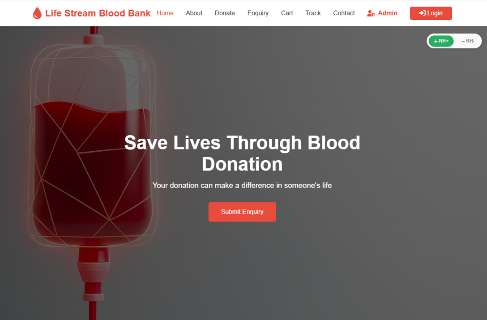

# BLOOD-BANK-MANAGEMENT-SYSTEM

---

# 🩸 E‑Com Blood Bank Website

## 📌 Overview

The **E‑Com Blood Bank Website** is a web application designed to streamline blood donation and distribution. It connects donors, recipients, and hospitals through a secure, user‑friendly platform. The system ensures transparency, availability tracking, and efficient management of blood units.

---

## 🚀 Features

- 🔐 **User Authentication** – Secure login/signup for donors, recipients, and admins
- 🧑‍🤝‍🧑 **Donor Management** – Register, update, and track donor details
- 🏥 **Hospital/Recipient Portal** – Request blood units and manage inventory
- 📊 **Inventory Tracking** – Real‑time availability of blood groups
- 💳 **E‑Commerce Integration** – Payment gateway for service charges (if applicable)
- 📍 **Location Services** – Find nearest blood banks and donors
- 📧 **Notifications** – Email/SMS alerts for requests, approvals, and donations

---

## 🛠️ Tech Stack

| Layer    | Technology Used      |
| -------- | -------------------- |
| Frontend | HTML, CSS, JavaScrpt |
| Backend  | PHP                  |
| Database | MySQL                |

---

## 📂 Project Structure

```
├── /frontend        # UI components
├── /backend         # API and server logic
├── /database        # Schema and migrations
├── /docs            # Documentation
└── README.md        # Project overview
```

---

## ⚙️ Installation & Setup

1. **Clone the repository**

   ```bash
   git clone https://github.com/sourav444-tec/BLOOD-BANK-MANAGEMENT-SYSTEM.git
   cd ecom-blood-bank

   ```

2. **Configure environment variables**

   - Create a `.env` file with:
     ```
     DB_HOST=localhost
     DB_USER=root
     DB_PASS= admin@123
     ```

3. **Run the application**
   ```bash
   npm start
   ```

## 📸 Screenshots



---

## 🤝 Contributing

Contributions are welcome!

- Fork the repo
- Create a new branch (`feature/your-feature`)
- Commit changes
- Open a Pull Request

---

## 🛡️ License

This project is licensed under the MIT License – see the [LICENSE](LICENSE) file for details.

---

## 📧 Contact

For queries or collaboration:

- **Email:** souravsanyal58231@gmail.com
- **GitHub:** [sourav444-tec]

---

Would you like me to tailor this README for **developers** (more technical, API‑focused) or for **end‑users** (more descriptive, usage‑focused)? That way I can refine the tone and details to match your audience.
